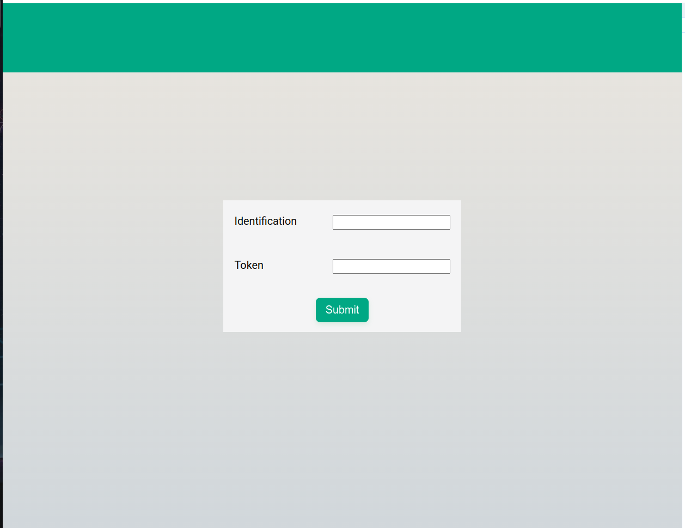
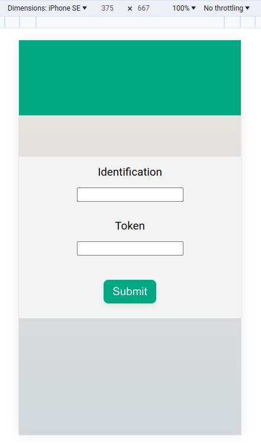
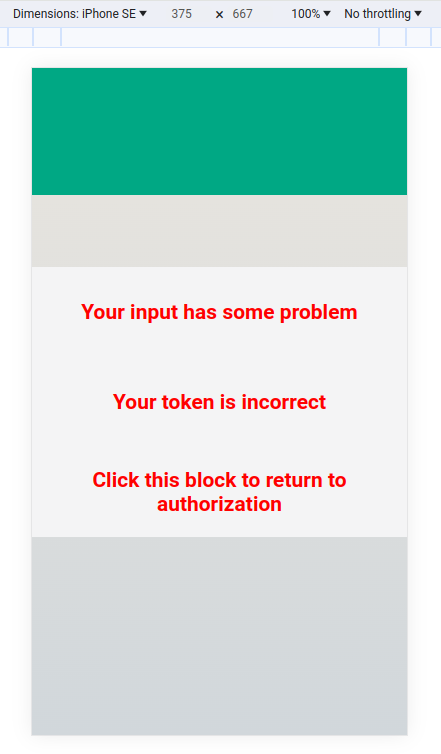
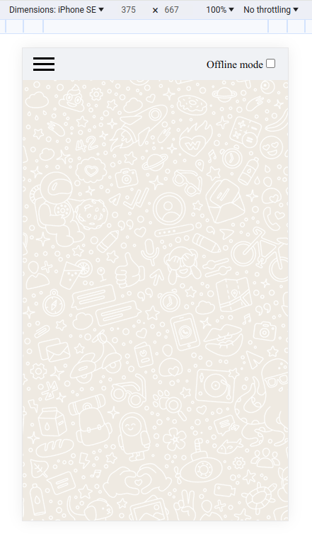
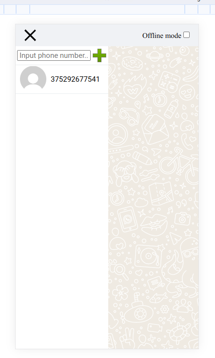
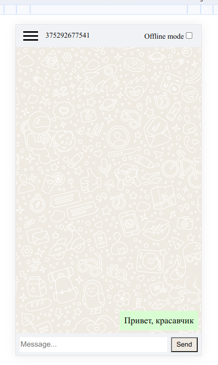
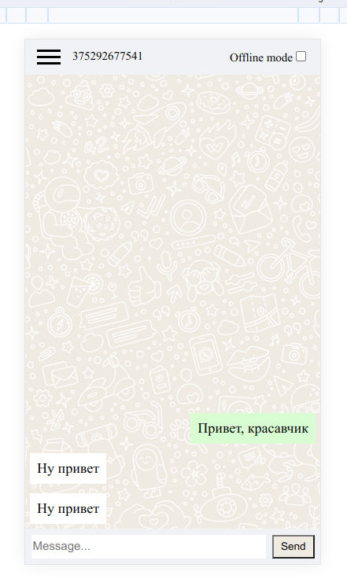

# Тестовое задание Whatsapp Чат

## Важно!

Для работы используется Green Api, позволяющий взаимодействовать с Whatsapp аккаунтом.
Перед этим нужно зарегистрироваться и создать инстанс на самом сайте: https://green-api.com/docs/before-start/
Для тестов могу предложить свой инстанс, однако помните!!!: все сообщения, отправленные с помощью моих данных,
будут видны мной лично в дальнейшем!  
Инстанс: 7103887540  
Токен: e41f096ad7474e999e08dbb6ec82ba35088eeb4259274130a9

## Функционал

Пользователь вписывает свои Green Api данные (id и token). 
Далее пользователь может добавить контакт для обмена сообщениями. 
Если контакт имеет Whatsapp, контакт будет создан.
Если имеется аватарка, она будет отображена. Если контакт имеет имя, оно будет отображено.
Далее отправляются сообщения. Реализованы как отправка, так и получение. Частично реализован оффлайн режим.
Отправленные в оффлайн режиме сообщения будут сохранены и после отключения оффлайн режима - отправлены.
Можно создать несколько чатов и общаться отдельно с каждым пользователем. Реализован перехват ошибок.


## Команды

```npm install``` - команда установки зависимостей

```npm run build``` - команда сборки проекта в папку public

```npm run dev``` - команда для запуска dev сервера

```npm run lint``` - команда для проверки синтаксиса (eslint)

```npm run lint:fix``` - команда для проверкии исправления синтаксиса (eslint)


## Скриншоты







  


